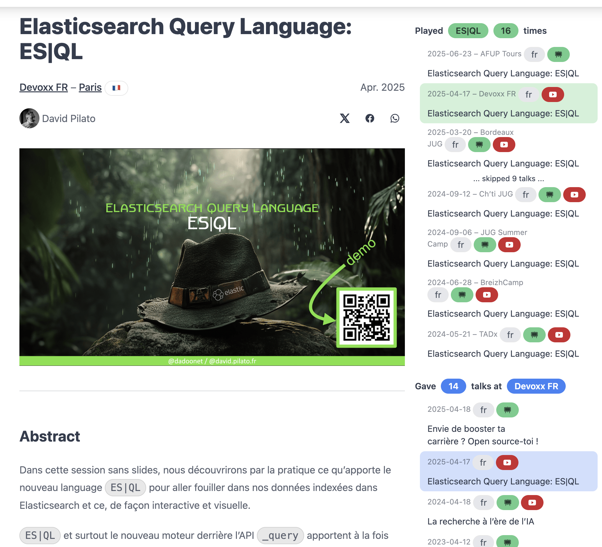

13 years at Elastic! 🎉 When I [joined this startup]() back in January 2013, I could never have imagined the journey that awaited me. From a risky decision to leave a comfortable government position in France to becoming part of one of the most exciting tech companies in the world, it has been an incredible ride.

This year, I wanted to celebrate this milestone differently. Instead of just sharing numbers and memories, I decided to embark on a technical adventure: **migrating all my speaker data from noti.st to my Hugo-based website** using Cursor AI as my pair programming partner.

Well, AI is everywhere now, so instead of just watching the news, I decided to try it myself and if it's something I will use in the long run.

<!--more-->

If you want to skip the technical details about Hugo, jump directly to the ["AI: Evil or Good?"](#ai-evil-or-good) chapter.

## Migration from speaker.pilato.fr

You can still find the old website running for a while at [https://noti.st/dadoonet](https://noti.st/dadoonet). It might disappear at some point.

### Why migrate from noti.st?

[Noti.st](https://noti.st) has been a fantastic platform for speakers to showcase their talks. I've been using it for years to track all my presentations. But the team did not really improve the project for years and I wanted more control over my data, better integration with my personal website, and the ability to display statistics and maps that matter to me.

My personal website already runs on [Hugo](https://gohugo.io/), a fast static site generator. So the idea was born (actually stolen from my boss [Philipp Krenn](https://xeraa.net/)):

> Why not bring all my speaker data directly into Hugo?

### The Cursor AI experiment

I decided to use [Cursor](https://cursor.sh/) to help me with this migration because I don't have much knowledge about frontend development and Hugo. What started as a simple experiment turned into an amazing pair programming session that lasted several weeks and **200+ commits**.

### The architecture we built together

Let me walk you through the key architectural decisions I made.

#### PDF storage on Google Cloud Storage

One of the first challenges was handling the PDF slides. With hundreds of presentations, that's a lot of binary files! GitHub has a [100MB file limit](https://docs.github.com/en/repositories/working-with-files/managing-large-files/about-large-files-on-github) and recommends keeping repositories under 1GB.

I initially tried **Git LFS** (Large File Storage), but it didn't feel right for this use case. Instead, I moved all PDFs to **Google Cloud Storage**:

```toml
# hugo.toml
[params.talks]
pdf_base_url = "https://storage.googleapis.com/dadoonet-talks/slides/"
```

Each talk references its PDF with a relative path:

```yaml
# In the frontmatter
pdf: "2024/2024-11-07-devfest-toulouse.pdf"
```

The `pdf.html` partial then builds the full URL dynamically.

#### Hugo partials for reusable components

Hugo's [partial templates](https://gohugo.io/templates/partials/) are powerful. We created 13 custom partials to keep the code DRY:

| Partial | Purpose |
|---------|---------|
| `pdf.html` | Interactive PDF viewer with navigation (first/prev/next/last), using pdf.js |
| `render_slide.html` | JavaScript module for rendering PDF pages on a canvas |
| `countryFlag.html` | Converts country codes (fr, us, be...) to emoji flags (🇫🇷, 🇺🇸, 🇧🇪) |
| `talks-map.html` | Interactive Leaflet.js map with all talk locations |
| `videoLabel.html` | Badge indicating if a video is available |
| `slidesLabel.html` | Badge indicating if slides are available |
| `langLabel.html` | Badge showing the talk language (FR/EN) |

The country flag partial is a nice example of Hugo's templating power:

```go-html-template
{{ $code := upper .country_code }}
{{ if eq $code "ONLINE" }}
  🌎
{{ else if eq (len $code) 2 }}
  {{ printf "%c%c" (add (index $code 0) 127397) (add (index $code 1) 127397) }}
{{ end }}
```

This converts a 2-letter country code to its emoji flag using Unicode regional indicator symbols!

#### Custom layouts for talks

The `layouts/talks/` directory contains specialized templates:

- **`single.html`** - The main talk page with slides, video, resources, and social buzz
- **`template.html`** - For "talk templates" showing all instances of a recurring talk
- **`map.html`** - Interactive world map of all speaking locations
- **`all.html`** - Chronological list of all talks
- **`videos.html`** - Gallery of recorded presentations

The `single.html` template is particularly rich - it includes:

- Conference information with clickable map links
- Embedded PDF viewer with keyboard navigation
- YouTube video embedding
- Resources section with cards
- Social media buzz (X/Twitter embeds, more to come)
- A smart sidebar showing "Played X times" for recurring talks
- Another sidebar showing "Gave X talks at [Conference]" for multi-year conferences

#### The "Played X times" sidebar

One feature Cursor suggested that I really love: when viewing a talk like "ES|QL", a sidebar appears listing all **X instances** where I've given this talk. It uses Hugo's frontmatter to group related talks:

```yaml
# In each talk's frontmatter
talk: "ES|QL"
```

The template then queries all pages with the same `talk` value and displays them chronologically with visual indicators for slides and video availability.



#### Frontmatter as a static database

Here's the key insight of this architecture: **I'm using frontmatter as a static database**.

Instead of storing my talks in a SQL or NoSQL database, all the data lives in YAML frontmatter at the top of each markdown file:

```yaml
---
title: "La recherche à l'ère de l'IA"
conference: 
  name: "DevFest Toulouse"
  city: "Toulouse"
  country: "France"
  country_code: "fr"
  latitude: "43.604652"
  longitude: "1.444209"
  url: "https://devfesttoulouse.fr/"
date: 2024-11-07
talk-lang: fr
talk: "Music Search"
pdf: "2024/2024-11-07-devfest-toulouse.pdf"
youtube: "FPW8nO0VGVg"
---
```

Hugo then becomes my **query engine**. I can:

- **Filter** talks by date, country, conference, or any field
- **Group** talks by year, topic, or location
- **Sort** by date, alphabetically, or custom criteria
- **Aggregate** statistics like "played X times" or "visited Y countries"
- **Join** related data (e.g., find all talks at the same conference)

For example, to find all talks with the same topic:

```go-html-template
{{ range where site.RegularPages "Params.talk" "Elasticsearch" }}
  {{ .Title }} - {{ .Date }}
{{ end }}
```

Or to count unique countries:

```go-html-template
{{ $countries := newScratch }}
{{ range $talks }}
  {{ $countries.SetInMap "countries" .Params.conference.country true }}
{{ end }}
Total countries: {{ len ($countries.Get "countries") }}
```

This approach has huge benefits:

- ✅ **No database to manage** - everything is in Git
- ✅ **Version controlled** - full history of every change
- ✅ **Portable** - just markdown files, readable anywhere
- ✅ **Fast** - Hugo builds the entire site in about a second
- ✅ **Offline capable** - works without any server
- ✅ **AI-friendly** - Cursor can read and modify the data easily!

It's the perfect match for a speaker portfolio: the data rarely changes, queries are predictable, and I get a blazing-fast static site as output.

## AI: Evil or Good?

At first, I was a bit hesitant to use AI. But after a few weeks of using it, I appreciate the "discussions" I have with whatever model I'm choosing. The Cursor experience is great and I think that I will continue to use it in the long run.

One of the very positive outcome is my learning curve. The AI model is showing you some code, here Hugo code, and you actually learn by reading the code and sometimes adapting it to your needs. At least at first. I was using a model which did not get right what I was expecting, so I was doing a lot of edits after all. But then I switched to anoter model which is much more accurate for my needs and I realize that I don't really review anymore what is produced as after some runs, I saw the code being right enough if you compare to what I'd have done myself.

But more than this, it helps me to solve my UI/JS/CSS lack of skills. I'm not a frontend developer. Of course I can learn, but this project would probably take me a year to complete if I did it alone. And to be honest, this is something I wanted to do for years but I never had the courage to start it.



But AI is not autonomous. It really needs the human creativity. Otherwise it's just giving a result which might not fit the way you imagine solving the business problem.

I surprised myself asking open questions to the model to discuss about the architecture to use. It's not AI deciding by itself but it's giving some ideas to discuss about and explore.

The feeling after some weeks is like having an always available pair programming partner who knows a lot about... well, everything! It helped me with data transformation, template creation, bug fixing, and even suggested improvements I hadn't thought of!

But I'm 54 years old now. So I think I have enough background to understand that AI is not a human even though sometimes I'm finding myself very polite with this "Machine", saying "thank you" or sharing my excitement about the result.
When I'm hearing my kids, it's not that clear that AI is not human. My daughter even told me that the AI she was speaking too was empathetic and caring. 😱

## 13 years of speaking - the statistics

Now that all my talks are in Hugo, let's look at what 13 years of evangelism looks like in numbers!

| Metric | Count |
|--------|-------|
| **Total talks** | 579 |
| **Countries** | 32 |
| **Cities** | 147 |

### Talks per year

Here's how my speaking activity evolved over the years:



The peak years were 2013-2014 when I was doing an incredible amount of BBLs (Brown Bag Lunches) across France. The dip in 2019-2020 corresponds to... well, you know what happened in 2020! 🦠

### Talks per location





France dominates (obviously, as I'm French!), but I'm proud to have spoken in 32 different countries over these 13 years.

If you look at the data per city, Paris region is the clear winner with 210+ talks! But interesting to see, I'm also speaking a lot in Lille, Bordeaux, Rennes, Nantes and La Rochelle.
Geneva is the first foreign city with 9 talks.

| City | Talks |
|------|-------|
| 🇫🇷 Paris | 213 |
| 🇫🇷 Lille | 17 |
| 🇫🇷 Bordeaux | 16 |
| 🇫🇷 Rennes | 11 |
| 🇫🇷 Nantes | 11 |
| 🇫🇷 La Rochelle | 10 |
| 🇨🇭 Geneva | 9 |
| 🇫🇷 Toulouse | 7 |
| 🇫🇷 Montpellier | 7 |
| 🇫🇷 Grenoble | 7 |
| 🇳🇱 Amsterdam | 7 |
| 🇫🇷 Tours | 7 |
| 🇫🇷 Marseille | 6 |
| 🇨🇦 Montreal | 6 |
| 🇬🇧 London | 6 |
| 🇫🇷 Lyon | 6 |
| 🇱🇺 Luxembourg | 6 |
| 🇫🇷 Nice | 5 |
| 🇧🇪 Brussels | 5 |
| 🇫🇷 Strasbourg | 5 |

The conference with the most talks is Devoxx France with 13 talks and JUG Summer Camp with 9 talks.

They both hold a special place in my heart:

- [Devoxx France](https://devoxx.fr/) is where I gave my [very first public talk about Elasticsearch]() back in April 2012!
- [JUG Summer Camp](https://www.jugsummercamp.org/) is happening in my hometown of La Rochelle in the exact location where my mother was working. And I like a lot the spirit of the event.

## What's next?

This migration project is now complete, and I'm thrilled with the result! You can explore all my talks on the new [speaker page](/talks/), browse the [full list of talks](/talks/all/), check the [type of talks](/talks/templates/) I'm giving or check out the [videos gallery](/talks/videos/).

The experience of using Cursor AI for this project has been eye-opening. What would have taken me months (or more likely, would have stayed in my "someday" list forever) was completed in just a few weeks. The combination of my domain knowledge and the AI's technical expertise proved to be incredibly powerful.

I'm already booked for several events in 2026:

- 🇫🇷 [SnowCamp](https://snowcamp.io/) (Grenoble) - January
- 🇫🇷 [Touraine Tech](https://touraine.tech/) (Tours) - February
- 🇫🇷 [AFUP Day](https://afup.org/events/afup-day-2026-lille/) (Lille) - May

Each of these will be added to my Hugo site with a simple markdown file - no more manual data entry on a third-party platform!

If you're a speaker thinking about managing your own talk portfolio, or if you're curious about using AI as a coding partner, I hope this article gave you some inspiration. And if you're attending any of these upcoming events, come say hi! I might look like a dinosaur 🦖 (as my colleagues like to call me), but I promise I'm friendly!

And as I have been saying in [my last talk]() about "Want to boost your career? Open source yourself!": the main driver for all of this for me is love. The love you can feel when you meet the community, the love you can feel when you share your knowledge, the love you can feel when you help someone else.



Thank you all for this! ❤️
