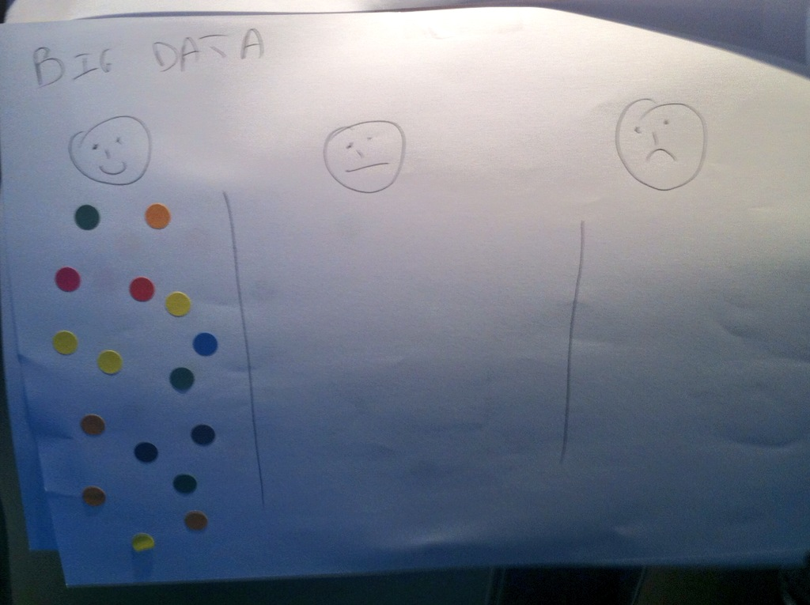
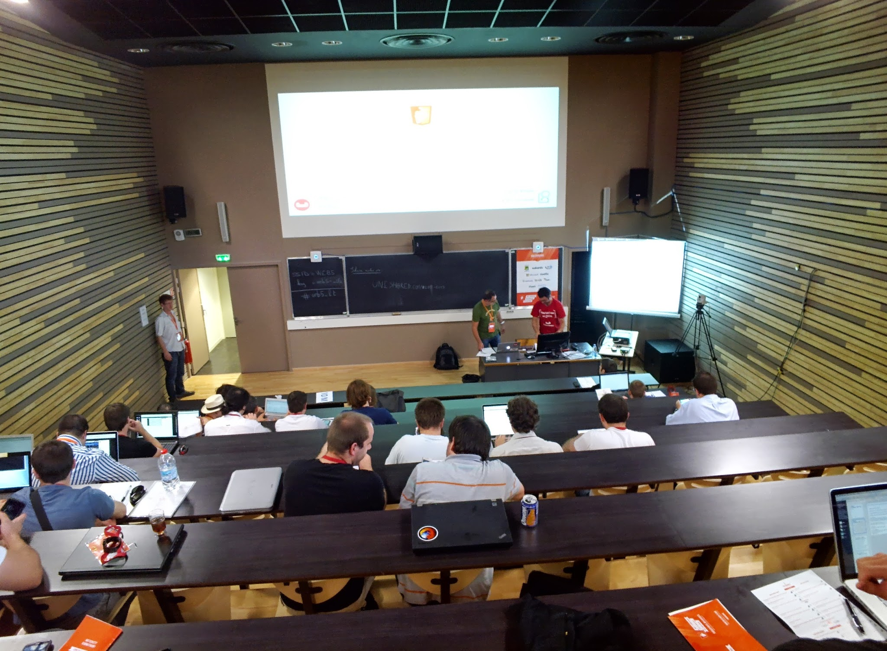

During this live coding session, Tugdual and David will take a classic full SQL application and rewrite it to NoSQL in 45 minutes.
Using CouchBase and Elasticsearch, they will highlight the benefits of this new architecture:

* Easy setup (productivity)
* Elasticity (scalability)

The topics covered will include:

* Document approach
* JSON
* REST
* Cache / Memcache
* Filters and Facets

Our devilish plan is to convert you to NoSQL so thoroughly that you won't be able to resist implementing it at home (and convincing your friends too)! Mwahaha! (evil laughter)

